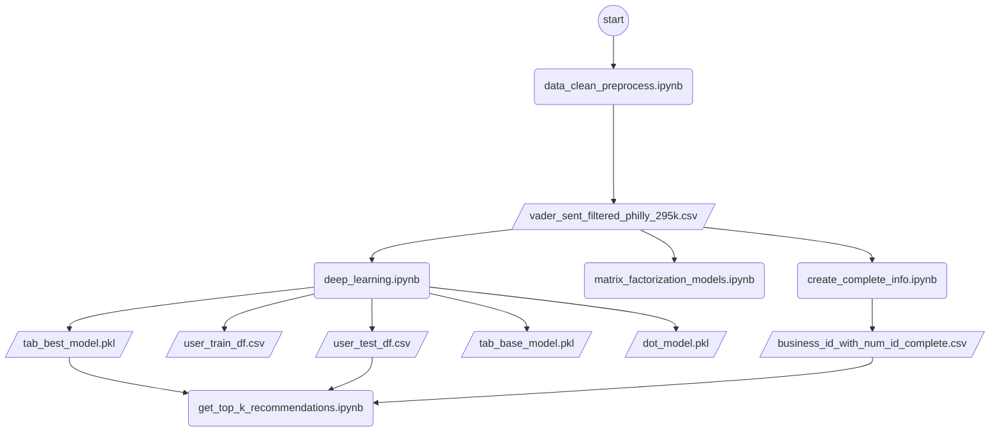

## Restaurant Recommendation System Project

___


 

These packages can be installed using pip by running the following command:

  

```

pip install -r requirements.txt

```

  

##### Replication

  

To run the code, follow these steps:

  

1. Download the dataset using kaggle's API (follow steps in the `data_clean_preprocess.ipynb`) or alternatively download the datasets & files from this [Yelp Dataset | Kaggle](https://www.kaggle.com/datasets/yelp-dataset/yelp-dataset) link and extract them to the data directory or use . Make sure all the files are within one directory './dataset'

3. Open the Jupyter Notebooks with your preferred way (JupyterLab, JupyterNotebook, VS Code, etc.)

6. Run each cell in the notebook by clicking the "Run" button or pressing "Shift + Enter".

7. The output of the notebook will be displayed in the Jupyter Notebook interface.

  

##### Notebooks

  

The notebooks should be run in the following order:

  

1.  `data_clean_preprocess.ipynb`: Preprocesses the raw data and saves the preprocessed data to a CSV file.

2.  `matrix_factorization_models.ipynb`: Implements and evaluates three matrix factorization models: SVD, SVD++, and NMF.

3.  `deep_learning.ipynb`: Implements and evaluates a deep learning-based model using FastAI.

4.  `get_top_k_recommendations.ipynb`: Generates top-k recommendations for a given user based on the best-performing model.

  

##### Flowchart

  

The following flowchart illustrates the data processing flow and the relationships between the notebooks:

  



  

if the flowchart doesn't render, please refer to the file *flowchart.png*
